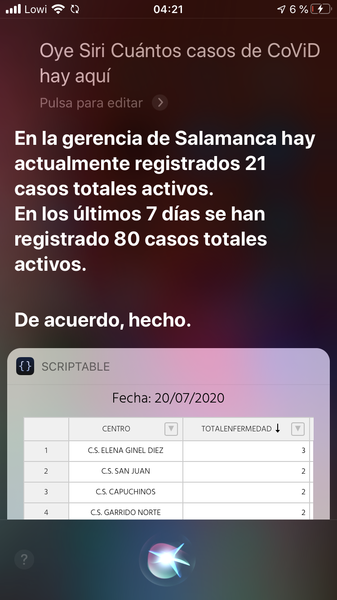

# CoViDCyL
Visualizador de todos los datos para el set 'Tasa de enfermos por zonas básicas de salud' - Datos CoViD-19 de Castilla y León

# Propósito:
Complementar la tabla online predeterminada del set de datos abiertos de Castilla y León sobre la incidencia diaria del SARS-CoV-2, mostrando todas las columnas para una gerencia de salud de la comunidad y una fecha en particular, además de un sumatorio para las cantidades absolutas de incidencia del virus. Se puede acceder desde <a href="https://mvarona.github.io/CoViDCyL" target="_blank">https://mvarona.github.io/CoViDCyL/</a>, y basta con especificar la gerencia de salud deseada para cargar los últimos datos disponibles. También se puede especificar una fecha en particular.

Los datos usados son accesibles desde el portal de <a href="https://analisis.datosabiertos.jcyl.es/explore/dataset/tasa-enfermos-acumulados-por-areas-de-salud/table/" target="_blank">datos abiertos de CyL</a>.

# Atajo de Siri
Es posible preguntarle a Siri* algo como _"¿Cuántos casos de CoViD hay aquí?"_ (o la frase deseada en su lugar), y que responda con el total de casos activos con síntomas compatibles estimados actualmente y en los últimos 7 días (sumatorios de los valores de las columnas _totalenfermedad_ y _totalenfermedad_7dias_, respectivamente):

Para ello, sólo hace falta tener instalada la app para iOS <a href="https://apps.apple.com/es/app/atajos/id915249334" target="_blank">Atajos</a>, <a href="https://support.apple.com/es-es/HT210628" target="_blank">Habilitar los atajos compartidos</a> y descargar el atajo pulsando en el siguiente enlace desde el dispositivo iOS:

<a href="https://www.icloud.com/shortcuts/e3a6b698a263456f85bb92113eff732c"> Descargar atajo</a>

Una vez instalado, será necesario que cambies el nombre de la gerencia de la que deseas obtener los últimos datos. Recuerda que el valor que elijas sólo puede ser uno de los siguientes, respetando mayúsculas y minúsculas:

- avila
- burgos
- leon
- palencia
- ponferrada
- salamanca
- segovia
- soria
- valladolidEste
- valladolidOeste
- zamora

Cambia, por tanto, el valor predeterminado de _salamanca_ a tu gerencia deseada de la lista anterior. Una vez pulses en _Listo_ podrás ejecutar tu atajo. Puedes hacerlo manualmente desde la propia app Atajos, o diciéndole a Siri _Oye Siri, ¿Cuántos casos de CoViD hay aquí?_.

## Viendo la tabla desde el atajo

El atajo incluye por defecto la posibilidad de ver una tabla reducida. Para ello, sólo tienes que instalar la app <a href="https://scriptable.app" target="_blank">Scriptable</a>, y crear un nuevo Script (botón +) con el siguiente texto (Archivo _Load CoViD data.script_):

`WebView.loadURL("https://mvarona.github.io/CoViDCyL?gerencia=salamanca&hideTitle=true", new Size(0,500), true);`

De nuevo, puedes cambiar la palabra _salamanca_ por la gerencia que te interese. Por último, guarda el script con el mismo nombre que uses en el Atajo, por defecto es _Load CoViD data_.

Si no quieres descargar Scriptable (o alguna app de terceros similar) Siri no podrá cargar una web en miniatura al ejecutar el atajo, pero sí puedes hacer que la abra en Safari sin ninguna app externa. Para ello sólo tienes que sustituir el último bloque del atajo de Siri por el bloque llamado _Mostrar sitio web_, e introducir la siguiente url: `https://mvarona.github.io/CoViDCyL?gerencia=salamanca&hideTitle=true`, sustituyendo _salamanca_ por tu gerencia deseada.

¡Ya está! Ya tienes un atajo con el que estar informado sobre la incidencia actual de la CoViD-19 en tu cercanía.

*Para ejecutar Atajos de Siri, se necesita iOS 12 o posterior en el iPhone, el iPod touch o el HomePod, un Apple Watch Series 3 o posterior y iOS 12 o iPadOS o posterior en el iPad.